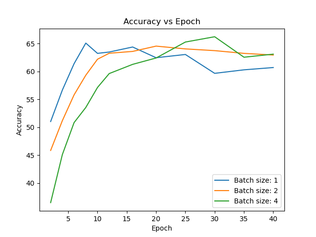
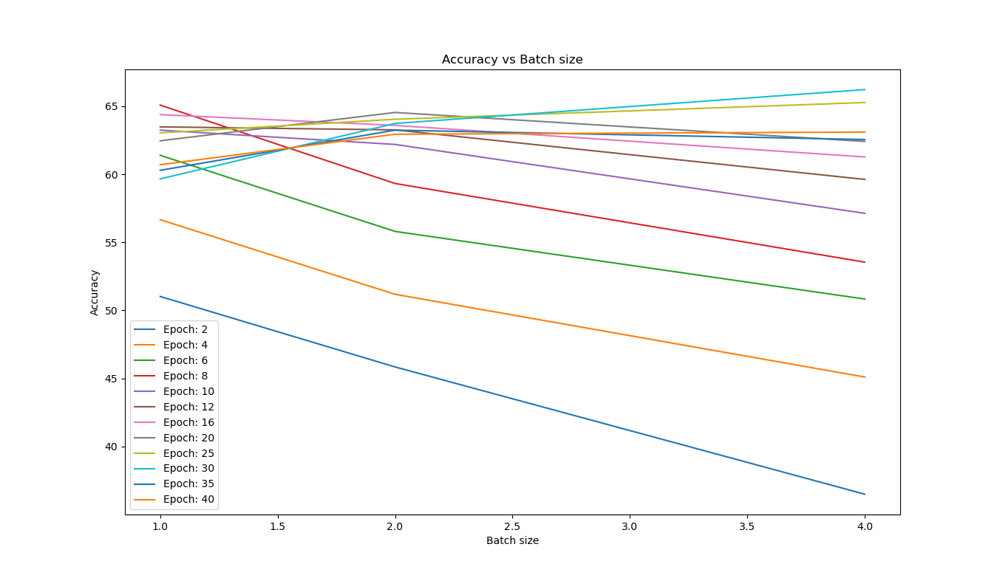
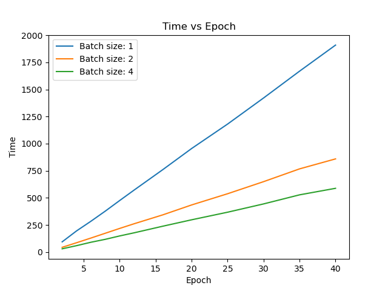
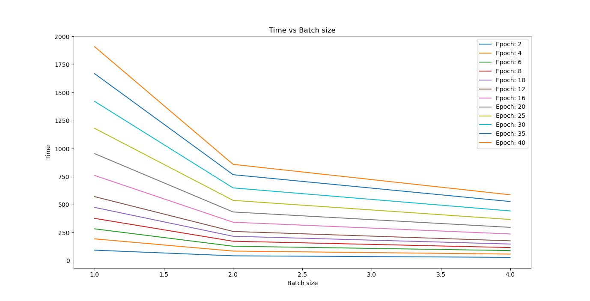

# Analysis for hyper parameter tests run on batch size 1 2 4
The test run on the following hyper parameters: 
- epoch_list = [2, 4, 6, 8, 10, 12, 16, 20, 25, 30, 35, 40]
- batch_size_list = [1, 2, 4]

Without further ado, let's look at the results.

## Accuracy
### Accuracy vs Epochs

This one shows a trend of increasing, peaking, decreasing for every batch number, but the peak appears with greater epoch number with the batch size getting larger. 

### Accuracy vs Batch size

This chart is really interesting yet informative. With smaller epochs, we can observe that the bigger the batch size, the lower the accuracy. However, with greater epoch numbers, the lines turned from decreasing to increasing, indicating that larger batch size will give better accuracy with larger epoch numbers. We can clearly see the red line (where epoch = 8) starts higher than the other lines representing larger epochs, but it is the peak of batch size 1. If you stay on batch size = 1 and follow the increasing epoch numbers, you'll see the trend identical to the last image. The same is true for other batch sizes. 

## Time
### Time vs Epochs

This just shows that the training time increases linearly as the epoch number gets larger. The smaller the batch size, the larger the slope.

### Time vs Batch size

This plot shows a decreasing (possibly exponentially, require further investigation, or maybe can be derived mathematically) trend of training time as the batch size gets larger. This is because the larger the batch size, the less number of batches we need to train the model. The greater the number of epochs, the greater the difference in time between different batch sizes.

### Time vs Accuracy with batches

Since we want a model to be trained to a high accuracy in short amount of time, the data points on the top left corner are the best.

### Time vs Accuracy with epochs

This one is similar to the last one. This one looks really cool too. According to what we found out with earlier plots, for every one line with three points, the batch size should be 4, 2, 1 respectively from left to right. That is because we know the larger the batch size, the shorter time it takes to train with the same epoch number, the lower the accuracy to start with. 